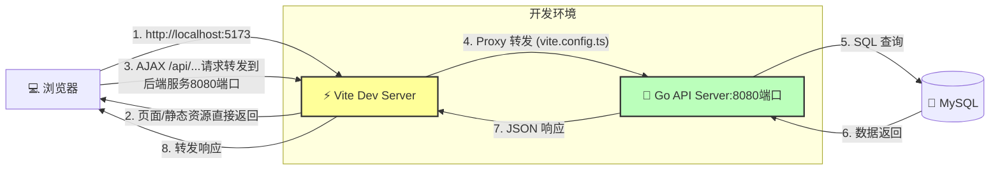
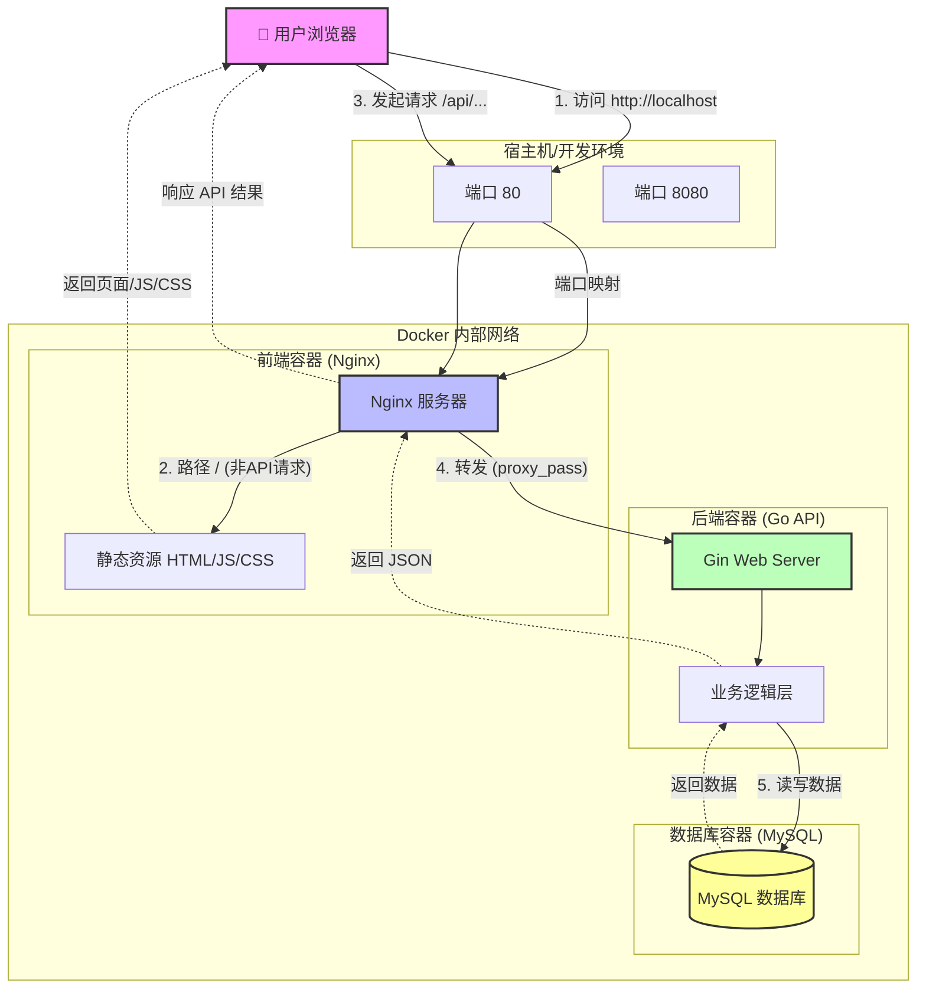
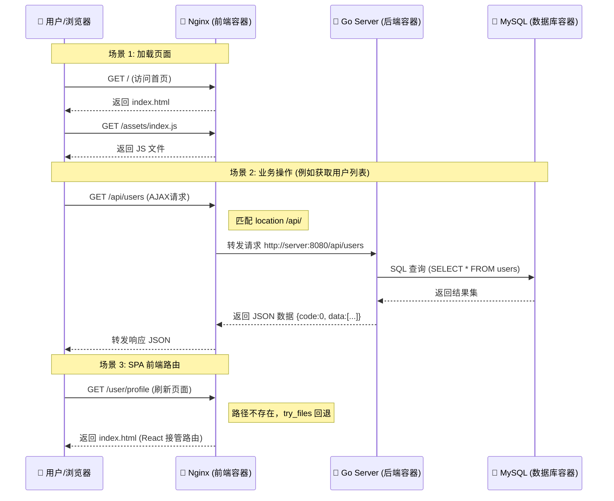

# Go Web MVC 项目

这是一个基于MVC架构的Go Web应用项目，包含前后端分离的完整实现。

## 技术栈

### 后端
- Go语言
- Gin Web框架
- GORM数据库ORM框架
- MySQL数据库

### 前端
- React框架
- Ant Design组件库
- Tailwind CSS样式框架
- Axios请求库

## 项目结构

```
.
├── server/             # 后端项目目录
│   ├── controllers/    # 控制器层
│   ├── models/         # 模型层
│   ├── services/       # 服务层
│   ├── routes/         # 路由配置
│   ├── middlewares/    # 中间件
│   ├── db/             # 数据库相关
│   ├── utils/          # 工具函数
│   ├── .env            # 环境配置文件
│   └── .env.local      # 本地环境配置文件（优先级更高）
│
├── web/                # 前端项目目录
│   ├── src/            # 源代码
│   ├── public/         # 静态资源
│   └── package.json    # 依赖配置
│
└── README.md           # 项目说明文档
```


## 如何运行

### 数据库配置

1. 确保已安装MySQL数据库
2. 使用`server/db/db.sql`文件创建数据库和表结构。

### 后端运行

1. 进入后端目录：

```bash
cd server
```

2. 配置环境变量（复制.env文件并按需修改）：

```bash
cp .env .env.local
# 编辑.env.local文件，配置数据库连接等信息
```

3. 下载依赖并运行：

```bash
go mod tidy
go run main.go
```

默认情况下，后端服务将在`http://localhost:8080`上运行。

### 前端运行

1. 进入前端目录：

```bash
cd web
```

2. 安装依赖：

```bash
npm install
```

3. 启动开发服务器：

```bash
npm run dev
```

默认情况下，前端开发服务器将在`http://localhost:5173`上运行，同时 vite会将 /api请求转发到后端服务也就是8080端口。

见vite.config.ts文件 proxy配置。

```ts
  proxy: {
    '/api': {
      target: 'http://localhost:8080',
      changeOrigin: true,
    },
  },
```

### 开发环境代理流程图 (开发环境：本地，开发环境：Docker容器)



## Docker部署

本项目支持通过Docker进行部署，包含前端、后端和MySQL数据库服务。


### 请求处理流程图 (生产环境：Docker容器)



### 详细时序图 (生产环境：Docker容器)



### 关于静态资源托管的替代方案
 在生产环境中，你也可以选择直接使用 Gin 框架处理静态资源文件（不使用 Nginx，所有请求直接转到后端服务），参考官方文档 [Serving static files](https://gin-gonic.com/en/docs/examples/serving-static-files/)。
 **但一般不推荐**，原因如下：
 - 因为 Nginx 在处理静态资源缓存、压缩和并发方面性能更好。
 - 前后端分离项目，前后端是独立部署与发布的，前端静态资源(js/css/图片等)通常放在CDN上，所以Nginx作为静态资源服务器(主要处理html，以及作为cdn源站)，以及负责API请求转发。

> 当然随着AI及全栈的发展，这也是一种架构的选择。


### 使用Docker Compose部署整个应用

1. 确保已安装Docker和Docker Compose

2. 在项目根目录下执行：

```bash
docker-compose up -d
```

这将启动三个服务:
- 前端服务 (Nginx托管的React应用)：http://localhost
- 后端服务 (Go API服务)：http://localhost:8080
- MySQL数据库服务

### 单独构建前端Docker镜像

如果只需要构建前端Docker镜像：

```bash
cd web
docker build -t go-web-mvc-frontend .
docker run -p 80:80 go-web-mvc-frontend
```

前端应用将通过Nginx在http://localhost上提供服务。

### 注意事项

- 前端Docker配置使用Nginx作为Web服务器
- Nginx配置已处理SPA前端路由问题
- API请求将被自动转发到后端服务
- 可以根据实际部署环境修改web/nginx.conf中的API转发配置


## API文档

API接口文档请参考`server/api.md`文件，前端开发时请按照API文档进行接口调用。

## 开发规范

- 后端遵循MVC架构模式
- 代码提交遵循规范化的Git Commit格式
- 接口返回统一使用HTTP 200状态码，通过返回体中的code字段区分成功与否
  - code=0：操作成功
  - code<0：操作失败
