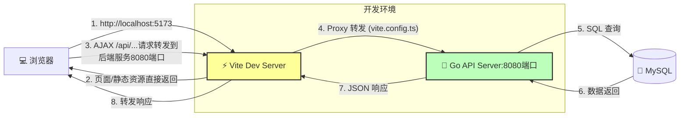
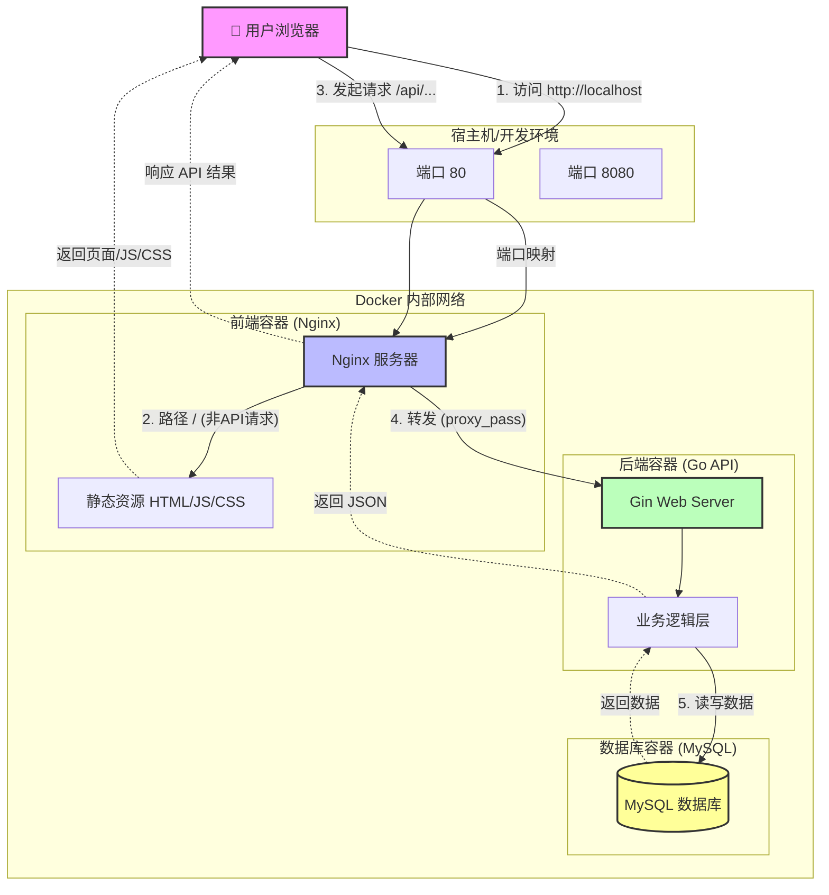
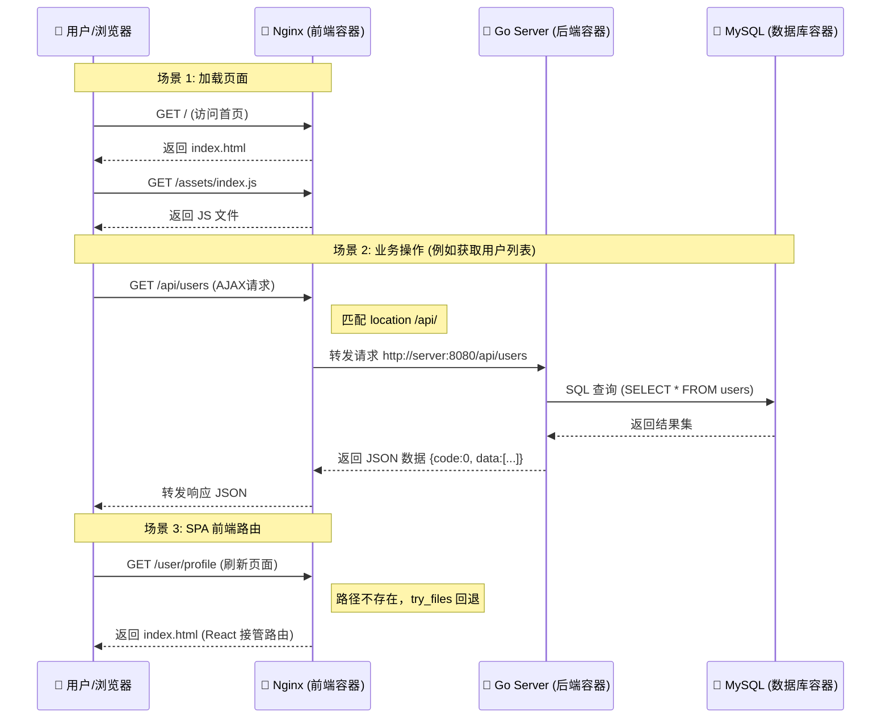

# Go Web MVC 项目

这是一个基于MVC架构的Go Web应用项目，包含前后端分离的完整实现。

## 技术栈

### 后端
- Go语言
- Gin Web框架
- GORM数据库ORM框架
- MySQL数据库

### 前端
- React框架
- Ant Design组件库
- Tailwind CSS样式框架
- Axios请求库

## 项目结构

```
.
├── docker-compose.yml  # 编排：前端(Nginx)+后端(Go)+MySQL
├── server/             # 后端项目目录
│   ├── Dockerfile      # 后端镜像构建
│   ├── DOCKER_GUIDE.md # 仅后端镜像构建/运行说明（教学向）
│   ├── controllers/    # 控制器层
│   ├── models/         # 模型层
│   ├── services/       # 服务层
│   ├── routes/         # 路由配置
│   ├── middleware/     # 中间件
│   ├── db/             # 数据库相关（含初始化 SQL）
│   ├── utils/          # 工具函数
│   ├── .env            # 环境配置文件
│   └── .env.local      # 本地环境配置文件（优先级更高）
│
├── web/                # 前端项目目录
│   ├── Dockerfile      # 前端镜像（构建产物 + Nginx）
│   ├── nginx.conf      # 生产环境 Nginx（API 转发至后端服务名 server）
│   ├── src/            # 源代码
│   ├── public/         # 静态资源
│   └── package.json    # 依赖配置
│
└── README.md           # 项目说明文档
```


## 如何运行

### 数据库配置

1. 确保已安装MySQL数据库
2. 使用`server/db/db.sql`文件创建数据库和表结构。

### 后端运行

1. 进入后端目录：

```bash
cd server
```

2. 配置环境变量（复制.env文件并按需修改）：

```bash
cp .env .env.local
# 编辑.env.local文件，配置数据库连接等信息
```

3. 下载依赖并运行：

```bash
go mod tidy
go run main.go
```

默认情况下，后端服务将在`http://localhost:8080`上运行。

### 前端运行

1. 进入前端目录：

```bash
cd web
```

2. 安装依赖：

```bash
npm install
```

3. 启动开发服务器：

```bash
npm run dev
```

默认情况下，前端开发服务器将在`http://localhost:5173`上运行，同时 vite会将 /api请求转发到后端服务也就是8080端口。

见vite.config.ts文件 proxy配置。

```ts
  proxy: {
    '/api': {
      target: 'http://localhost:8080',
      changeOrigin: true,
    },
  },
```

### 开发环境代理流程图 (开发环境：本地，开发环境：Docker容器)


```mermaid
graph LR
    Browser[💻 浏览器]
    
    subgraph DevEnvironment ["开发环境"]
        Vite[⚡ Vite Dev Server]
        GoServer[🐹 Go API Server:8080端口]
    end
    
    DB[(🐬 MySQL)]

    %% 连接关系
    Browser -- "1. http://localhost:5173" --> Vite
    
    Vite -- "2. 页面/静态资源直接返回" --> Browser
    
    Browser -- "3. AJAX /api/...请求转发到后端服务8080端口" --> Vite
    
    Vite -- "4. Proxy 转发 (vite.config.ts)" --> GoServer
    
    GoServer -- "5. SQL 查询" --> DB
    DB -- "6. 数据返回" --> GoServer
    
    GoServer -- "7. JSON 响应" --> Vite
    Vite -- "8. 转发响应" --> Browser

    %% 样式
    style Vite fill:#ff9,stroke:#333,stroke-width:2px
    style GoServer fill:#bfb,stroke:#333,stroke-width:2px
```

## Docker部署

本项目支持通过Docker进行部署，包含前端、后端和MySQL数据库服务。


### 请求处理流程图 (生产环境：Docker容器)


```mermaid
graph TD
    User[👤 用户浏览器]
    
    subgraph Docker Host [宿主机/开发环境]
        P80[端口 80]
        P8080[端口 8080]
    end

    subgraph Docker Network [Docker 内部网络]
        subgraph WebContainer ["前端容器 (Nginx)"]
            Nginx[Nginx 服务器]
            StaticFiles[静态资源 HTML/JS/CSS]
        end
        
        subgraph ServerContainer ["后端容器 (Go API)"]
            GinServer[Gin Web Server]
            Logic[业务逻辑层]
        end
        
        subgraph DBContainer ["数据库容器 (MySQL)"]
            MySQL[(MySQL 数据库)]
        end
    end

    %% 流程连线
    User -- "1. 访问 http://localhost" --> P80
    P80 -- "端口映射" --> Nginx
    
    Nginx -- "2. 路径 / (非API请求)" --> StaticFiles
    StaticFiles -.-> |"返回页面/JS/CSS"| User
    
    User -- "3. 发起请求 /api/..." --> P80
    P80 --> Nginx
    
    Nginx -- "4. 转发 (proxy_pass)" --> GinServer
    GinServer --> Logic
    Logic -- "5. 读写数据" --> MySQL
    MySQL -.-> |"返回数据"| Logic
    Logic -.-> |"返回 JSON"| Nginx
    Nginx -.-> |"响应 API 结果"| User

    %% 样式
    style User fill:#f9f,stroke:#333,stroke-width:2px
    style Nginx fill:#bbf,stroke:#333,stroke-width:2px
    style GinServer fill:#bfb,stroke:#333,stroke-width:2px
    style MySQL fill:#ff9,stroke:#333,stroke-width:2px
```

### 详细时序图 (生产环境：Docker容器)


```mermaid
sequenceDiagram
    participant User as 👤 用户/浏览器
    participant Nginx as 🐳 Nginx (前端容器)
    participant Go as 🐹 Go Server (后端容器)
    participant DB as 🐬 MySQL (数据库容器)

    Note over User, Nginx: 场景 1: 加载页面
    User->>Nginx: GET / (访问首页)
    Nginx-->>User: 返回 index.html
    User->>Nginx: GET /assets/index.js
    Nginx-->>User: 返回 JS 文件

    Note over User, DB: 场景 2: 业务操作 (例如获取用户列表)
    User->>Nginx: GET /api/users (AJAX请求)
    Note right of Nginx: 匹配 location /api/
    Nginx->>Go: 转发请求 http://server:8080/api/users
    Go->>DB: SQL 查询 (SELECT * FROM users)
    DB-->>Go: 返回结果集
    Go-->>Nginx: 返回 JSON 数据 {code:0, data:[...]}
    Nginx-->>User: 转发响应 JSON

    Note over User, Nginx: 场景 3: SPA 前端路由
    User->>Nginx: GET /user/profile (刷新页面)
    Note right of Nginx: 路径不存在，try_files 回退
    Nginx-->>User: 返回 index.html (React 接管路由)
```

### 关于静态资源托管的替代方案
 在生产环境中，你也可以选择直接使用 Gin 框架处理静态资源文件（不使用 Nginx，所有请求直接转到后端服务），参考官方文档 [Serving static files](https://gin-gonic.com/en/docs/examples/serving-static-files/)。
 **但一般不推荐**，原因如下：
 - 因为 Nginx 在处理静态资源缓存、压缩和并发方面性能更好。
 - 前后端分离项目，前后端是独立部署与发布的，前端静态资源(js/css/图片等)通常放在CDN上，所以Nginx作为静态资源服务器(主要处理html，以及作为cdn源站)，以及负责API请求转发。

> 当然随着AI及全栈的发展，这也是一种架构的选择。


### 使用Docker Compose部署整个应用

1. 确保已安装 Docker 与 Docker Compose（Compose V2 可使用 `docker compose` 命令）。

2. 在**仓库根目录**（与 `docker-compose.yml` 同级）执行：

```bash
docker-compose up -d
```

后端 Docker 的单独构建与说明另见 `server/DOCKER_GUIDE.md`。

这将启动三个服务:
- 前端服务 (Nginx托管的React应用)：http://localhost
- 后端服务 (Go API服务)：http://localhost:8080
- MySQL数据库服务

#### Compose 服务与端口一览

| Compose 服务名 | 容器内角色 | 宿主机端口 |
|----------------|------------|------------|
| `web` | Nginx + 前端静态资源 | **80** |
| `server` | Gin API | **8080** |
| `mysql` | MySQL 8 | **3306** |

默认数据库：`student_management`，root 密码与编排文件中 `MYSQL_ROOT_PASSWORD`、后端的 `DB_PASSWORD` 一致（当前示例为 `123456`）。**生产环境请务必改为强密码并在编排或密钥管理中注入。**

### 常用运维命令与排查

```bash
# 查看日志（在项目根目录）
docker compose logs -f
docker compose logs -f server

# 修改 Dockerfile 或依赖后强制重建镜像再启动
docker compose up -d --build

# 清理编排创建的容器与网络（数据卷可选保留）
docker compose down

# 同时删掉 MySQL 数据卷（慎用：库内数据清空）
docker compose down -v
```

若 **80 端口被占用**，可临时改为例如 `"8081:80"`（改 `docker-compose.yml` 中 `web` 的 `ports`），浏览器访问 `http://localhost:8081`。

后端启动失败多为 **数据库未就绪或账号密码不一致**：可看 `docker compose logs server`，并对比 `mysql` 与 `server` 的环境变量是否与 `docker-compose.yml` 一致。

### 单独构建前端Docker镜像

如果只需要构建前端 Docker 镜像：

```bash
cd web
docker build -t go-web-mvc-frontend .
docker run -p 80:80 go-web-mvc-frontend
```

前端应用将通过 Nginx 在 `http://localhost` 上提供静态页。**注意**：当前 `web/nginx.conf` 将 `/api/` 转发到 `http://server:8080`，该主机名仅在 **Compose 编排或同一自定义网络上的后端容器** 中存在。若只起一个前端容器而没有同名后端容器，浏览器请求 API 会失败；此时需要同时运行后端（或改用 `host.docker.internal` 等方式指向宿主机后端，详见 Docker 文档）。

### 注意事项

- 前端 Docker 配置使用 Nginx 作为 Web 服务器
- Nginx 配置已处理 SPA 前端路由问题
- `/api/` 请求由 Nginx 反向代理到后端 Compose 服务名 **`server`**（端口 8080）
- 可根据实际部署修改 `web/nginx.conf` 中的 `proxy_pass`


## API文档

API接口文档请参考`server/api.md`文件，前端开发时请按照API文档进行接口调用。

## 开发规范

- 后端遵循MVC架构模式
- 代码提交遵循规范化的Git Commit格式
- 接口返回统一使用HTTP 200状态码，通过返回体中的code字段区分成功与否
  - code=0：操作成功
  - code<0：操作失败
